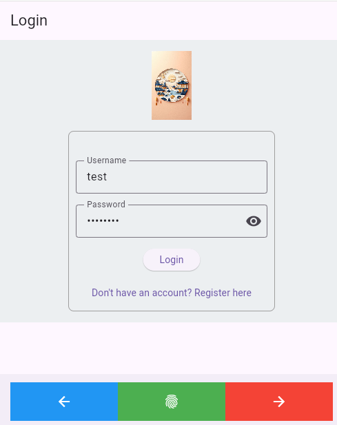
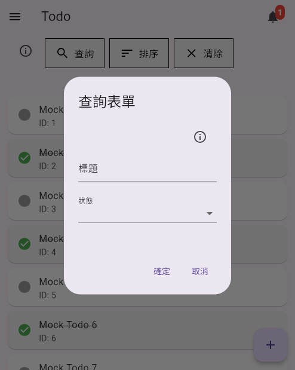
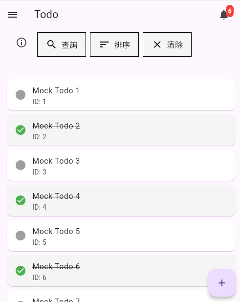
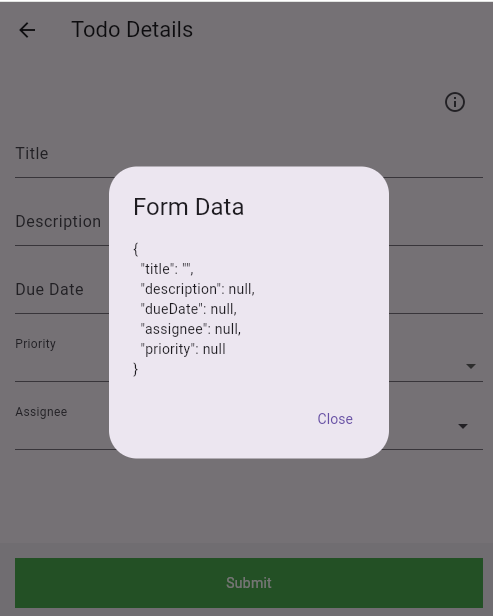
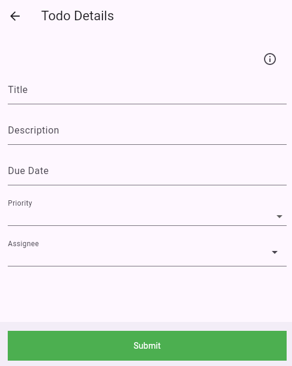

# My_Flutter_Framework

`My_Flutter_Framework` 是一個基於 Flutter 的框架，旨在快速構建高效、可擴展的應用程式。此框架包含多種常用的功能模組，並提供了靈活的擴展能力。

---

## 功能模組

### 1. 登入頁
- 提供用戶登入功能。
- 支援表單驗證與錯誤提示。
- 可自訂登入流程。



### 2. 查詢表單頁
- 支援動態生成查詢表單。
- 可保存與載入查詢條件。
- 支援排序與篩選功能。





### 3. 通用表單模組
- 使用 `DevFormBuilder` 提供靈活的表單構建能力。
- 支援表單驗證、初始值設定與資料提交。



### 4. 自訂樣式與主題
- 提供統一的樣式與顏色配置（如 `AppColor`）。
- 支援自訂按鈕與表單樣式。

---

## 安裝與使用

### 1. 環境需求
- Flutter SDK: `>=3.0.0`
- Dart: `>=2.17.0`

### 2. 安裝依賴
請確保已安裝必要的依賴，並執行以下命令：
```bash
flutter pub get
```


